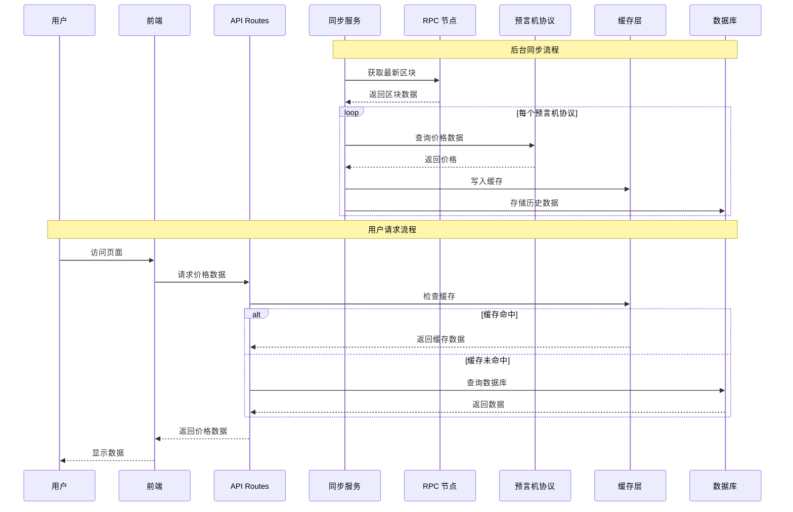
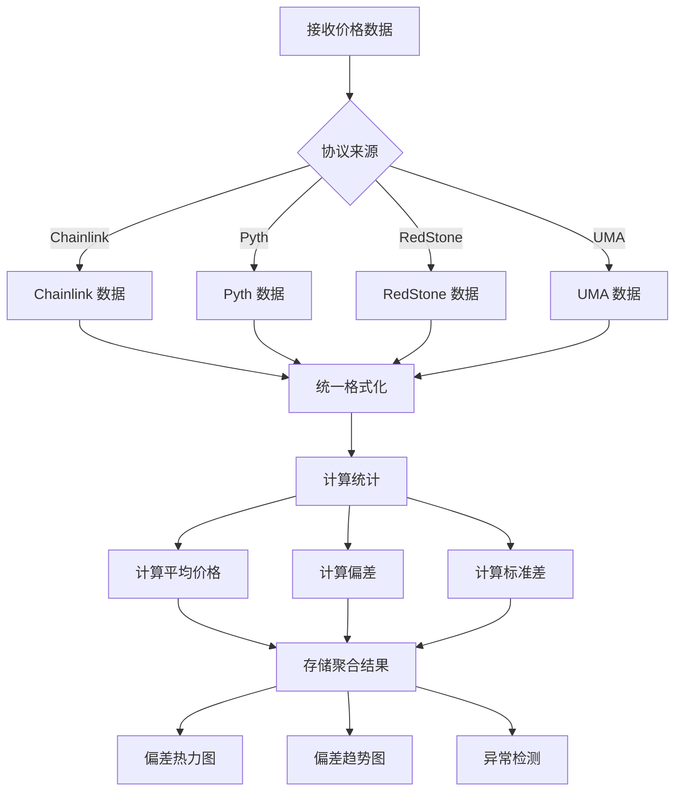
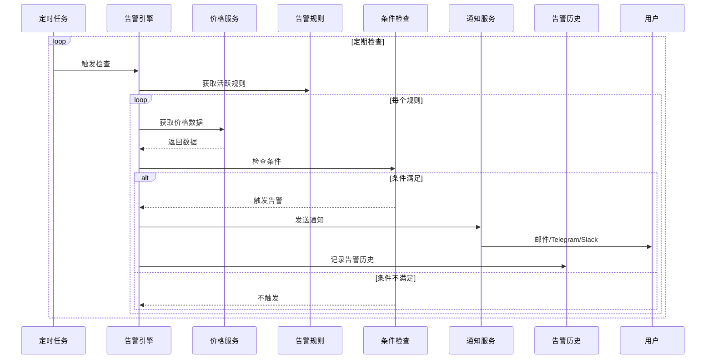
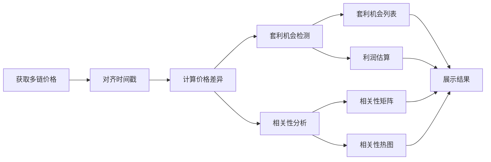

# 数据流图

本文档包含 Insight 系统关键功能的数据流图。

## 目录

- [预言机数据同步流程](#预言机数据同步流程)
- [价格聚合数据流](#价格聚合数据流)
- [告警触发流程](#告警触发流程)
- [跨链分析数据流](#跨链分析数据流)

---

## 预言机数据同步流程

### 概述

本流程描述 Insight 如何从多个预言机协议获取数据并存储到数据库。

### 详细步骤

#### 1. 后台同步

1. **同步服务启动**
   - 从 `sync_state` 表读取上次同步的区块号
   - 从 RPC 节点获取最新区块号
   - 计算需要同步的区块范围

2. **数据获取**
   - 遍历每个配置的预言机协议（Chainlink、Pyth、RedStone、UMA）
   - 从各协议获取价格数据
   - 统一数据格式

3. **数据存储**
   - 写入缓存（Redis）
   - 存储历史数据到数据库
   - 更新同步状态

#### 2. 用户请求

1. **前端发起请求**
   - 用户访问页面
   - 前端调用 API

2. **API 处理请求**
   - 先检查缓存
   - 缓存命中则直接返回
   - 缓存未命中则查询数据库

3. **返回数据**
   - 返回统一格式数据
   - 前端渲染展示

---

## 价格聚合数据流

### 概述

描述多个预言机协议价格聚合和偏差计算流程。

### 详细步骤

#### 1. 数据接收与聚合

1. **接收多源数据**
   - 从各协议原始数据
   - 时间戳对齐

2. **统一格式化**
   - 统一数据结构
   - 标准化价格格式
   - 验证数据有效性

3. **统计计算**
   - 计算平均价格
   - 计算最大/最小值
   - 计算标准差
   - 计算各协议相对于平均值的偏差

4. **存储结果**
   - 缓存聚合结果
   - 写入数据库

#### 2. 数据分析

1. **偏差热力图**
   - 两两协议间偏差
   - 颜色编码偏差大小

2. **偏差趋势图**
   - 时间序列数据
   - 趋势线分析

3. **异常检测**
   - 统计异常检测
   - 阈值触发
   - 告警触发

---

## 告警触发流程

### 概述

描述告警规则检查和通知发送流程。

### 详细步骤

#### 1. 告警检查

1. **定时触发**
   - 定时任务定期触发检查
   - 可配置检查频率

2. **获取规则**
   - 从数据库读取活跃告警规则
   - 加载规则配置

3. **获取数据**
   - 根据规则获取对应价格数据
   - 获取历史数据用于比较

4. **条件检查**
   - 价格偏差检查
   - 价格阈值检查
   - 数据陈旧检查
   - 多条件组合

#### 2. 告警处理

1. **触发告警**
   - 条件满足时触发
   - 去重检查（避免重复告警）

2. **发送通知**
   - 邮件
   - Telegram 机器人
   - Slack Webhook
   - 自定义 Webhook

3. **记录历史**
   - 记录告警事件
   - 记录触发时间
   - 记录当时数据

---

## 跨链分析数据流

### 概述

描述跨链价格比较和套利机会识别流程。

### 详细步骤

#### 1. 数据获取

1. **获取多链数据**
   - 各链 RPC 节点
   - 各链预言机协议
   - 价格数据

2. **对齐时间戳**
   - 时间对齐
   - 缺失数据插值

#### 2. 分析计算

1. **价格差异计算**
   - 链间价格差
   - 百分比差异

2. **相关性分析**
   - 皮尔逊相关系数
   - 时间序列相关性

3. **套利检测**
   - 价格差超过阈值
   - 扣除 gas 成本估算
   - 利润计算

#### 3. 结果展示

1. **相关性矩阵**
   - 矩阵展示
   - 热图可视化

2. **套利机会**
   - 机会列表
   - 利润估算
   - 风险提示

---

**返回 [文档总索引](../README.md)**
