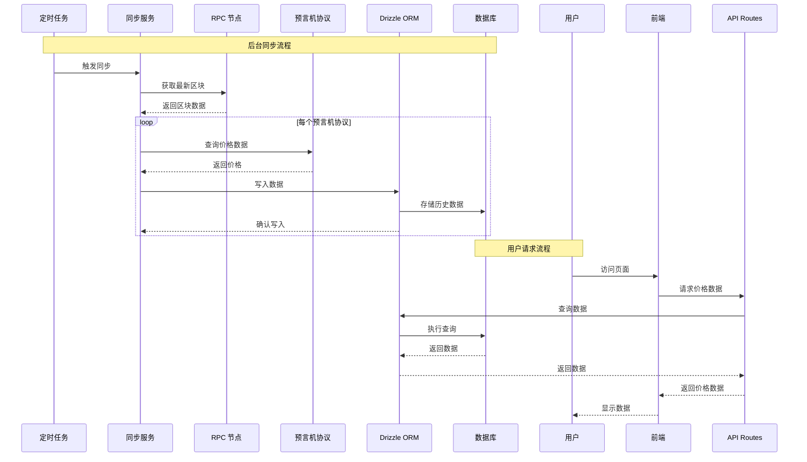
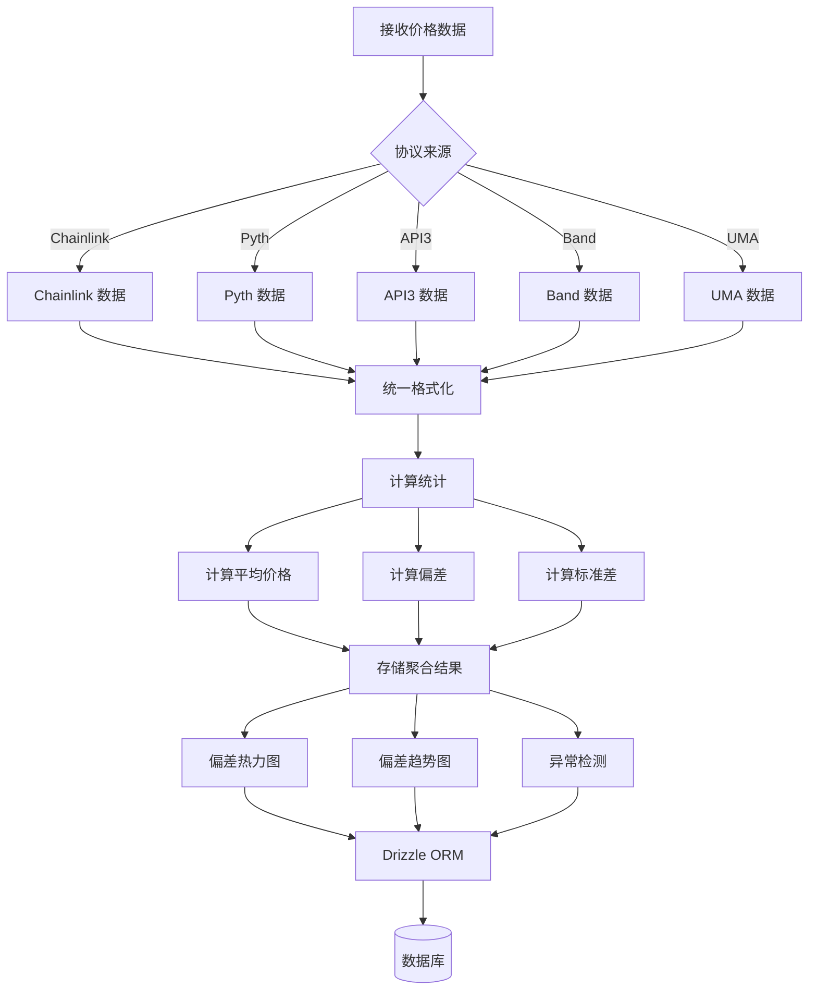
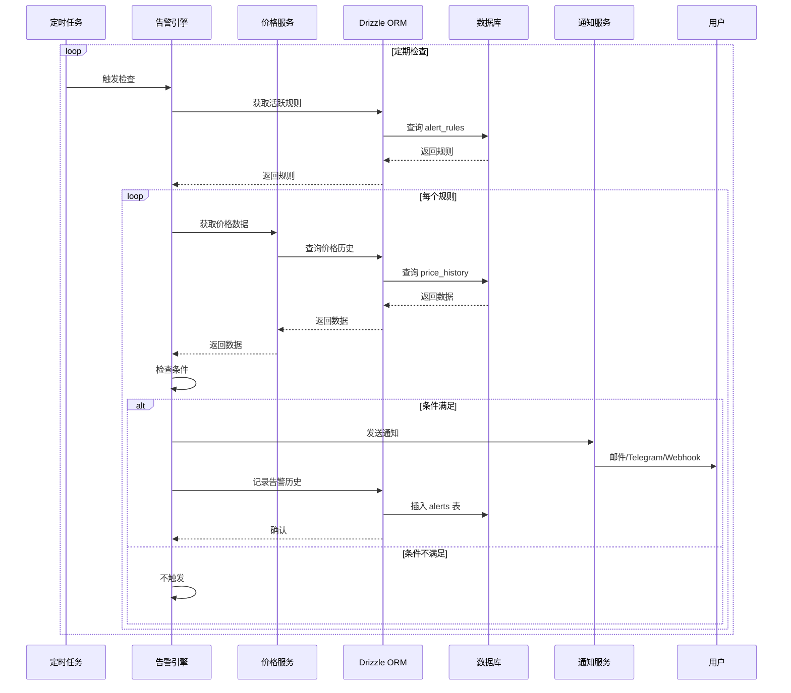
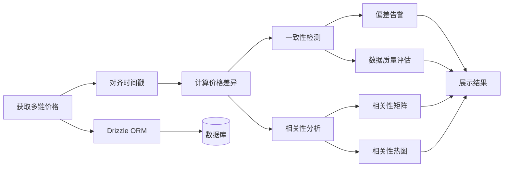
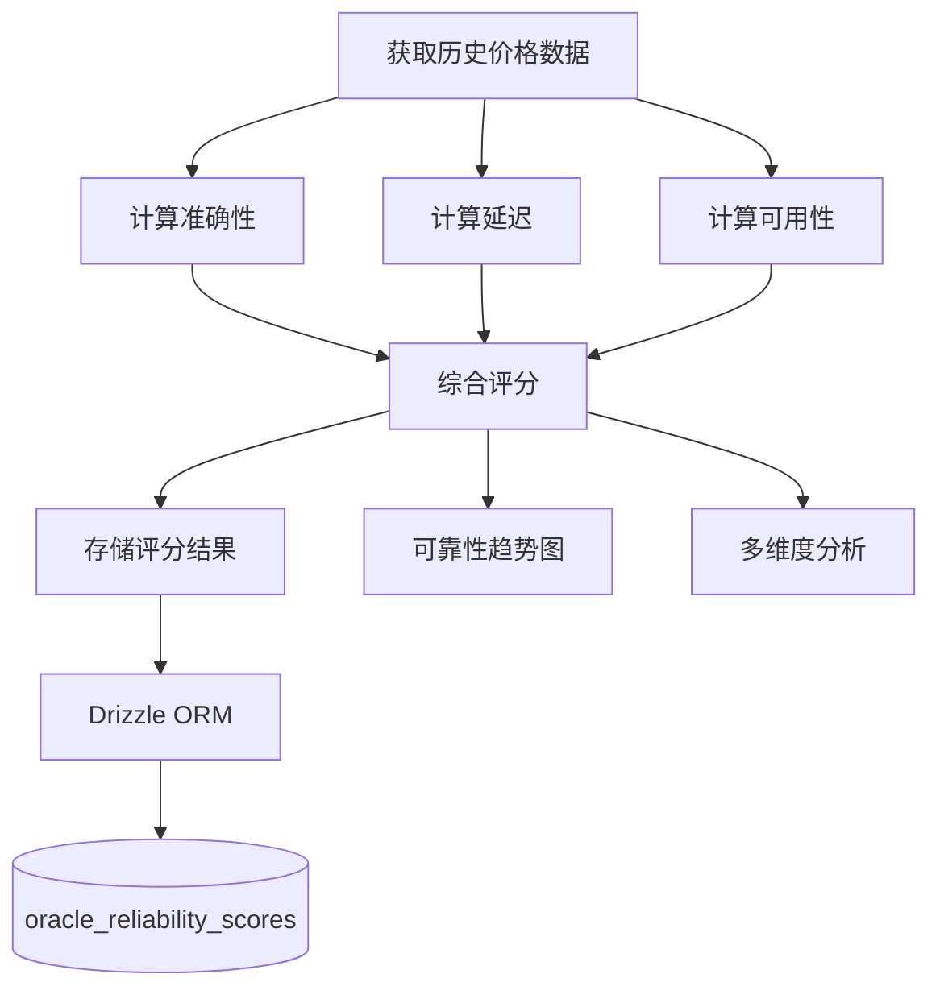

# 数据流图

本文档包含 Insight 系统关键功能的数据流图。

## 目录

- [预言机数据同步流程](#预言机数据同步流程)
- [价格聚合数据流](#价格聚合数据流)
- [告警触发流程](#告警触发流程)
- [跨链分析数据流](#跨链分析数据流)
- [可靠性评分数据流](#可靠性评分数据流)

---

## 预言机数据同步流程

### 概述

本流程描述 Insight 如何从多个预言机协议获取数据并存储到数据库。

```mermaid
sequenceDiagram
    participant Cron as 定时任务
    participant SyncService as 同步服务
    participant RPC as RPC 节点
    participant Oracle as 预言机协议
    participant Drizzle as Drizzle ORM
    participant DB as 数据库
    participant User as 用户
    participant Frontend as 前端
    participant API as API Routes

    Note over Cron,DB: 后台同步流程

    Cron->>SyncService: 触发同步
    SyncService->>RPC: 获取最新区块
    RPC-->>SyncService: 返回区块数据

    loop 每个预言机协议
        SyncService->>Oracle: 查询价格数据
        Oracle-->>SyncService: 返回价格
        SyncService->>Drizzle: 写入数据
        Drizzle->>DB: 存储历史数据
        Drizzle-->>SyncService: 确认写入
    end

    Note over User,DB: 用户请求流程

    User->>Frontend: 访问页面
    Frontend->>API: 请求价格数据
    API->>Drizzle: 查询数据
    Drizzle->>DB: 执行查询
    DB-->>Drizzle: 返回数据
    Drizzle-->>API: 返回数据
    API-->>Frontend: 返回价格数据
    Frontend-->>User: 显示数据
```

### 详细步骤

#### 1. 后台同步

1. **同步服务启动**
   - 从 `sync_state` 表读取上次同步的区块号
   - 从 RPC 节点获取最新区块号
   - 计算需要同步的区块范围

2. **数据获取**
   - 遍历每个配置的预言机协议（Chainlink、Pyth、API3、Band、UMA）
   - 从各协议获取价格数据
   - 统一数据格式

3. **数据存储**
   - 通过 Drizzle ORM 写入数据库
   - 存储历史数据到 `price_history` 表
   - 更新同步状态到 `sync_state` 和 `oracle_sync_state` 表

#### 2. 用户请求

1. **前端发起请求**
   - 用户访问页面
   - 前端调用 API

2. **API 处理请求**
   - 通过 Drizzle ORM 查询数据库
   - 按需使用索引优化查询性能

3. **返回数据**
   - 返回统一格式数据
   - 前端渲染展示

---

## 价格聚合数据流

### 概述

描述多个预言机协议价格聚合和偏差计算流程。

```mermaid
flowchart TD
    A[接收价格数据] --> B{协议来源}
    B -->|Chainlink| C1[Chainlink 数据]
    B -->|Pyth| C2[Pyth 数据]
    B -->|API3| C3[API3 数据]
    B -->|Band| C4[Band 数据]
    B -->|UMA| C5[UMA 数据]

    C1 --> D[统一格式化]
    C2 --> D
    C3 --> D
    C4 --> D
    C5 --> D

    D --> E[计算统计]

    E --> F1[计算平均价格]
    E --> F2[计算偏差]
    E --> F3[计算标准差]

    F1 --> G[存储聚合结果]
    F2 --> G
    F3 --> G

    G --> H[偏差热力图]
    G --> I[偏差趋势图]
    G --> J[异常检测]

    H --> Drizzle[Drizzle ORM]
    I --> Drizzle
    J --> Drizzle

    Drizzle --> DB[(数据库)]
```

### 详细步骤

#### 1. 数据接收与聚合

1. **接收多源数据**
   - 从各协议原始数据
   - 时间戳对齐

2. **统一格式化**
   - 统一数据结构
   - 标准化价格格式
   - 验证数据有效性

3. **统计计算**
   - 计算平均价格
   - 计算最大/最小值
   - 计算标准差
   - 计算各协议相对于平均值的偏差

4. **存储结果**
   - 通过 Drizzle ORM 存储到 `price_history` 表
   - 包含 protocol、symbol、chain、price、deviation、latency_ms 等字段

#### 2. 数据分析

1. **偏差热力图**
   - 两两协议间偏差
   - 颜色编码偏差大小

2. **偏差趋势图**
   - 时间序列数据
   - 趋势线分析

3. **异常检测**
   - 统计异常检测
   - 阈值触发
   - 告警触发

---

## 告警触发流程

### 概述

描述告警规则检查和通知发送流程。

```mermaid
sequenceDiagram
    participant Scheduler as 定时任务
    participant AlertEngine as 告警引擎
    participant PriceService as 价格服务
    participant Drizzle as Drizzle ORM
    participant DB as 数据库
    participant Notifier as 通知服务
    participant User as 用户

    loop 定期检查
        Scheduler->>AlertEngine: 触发检查
        AlertEngine->>Drizzle: 获取活跃规则
        Drizzle->>DB: 查询 alert_rules
        DB-->>Drizzle: 返回规则
        Drizzle-->>AlertEngine: 返回规则

        loop 每个规则
            AlertEngine->>PriceService: 获取价格数据
            PriceService->>Drizzle: 查询价格历史
            Drizzle->>DB: 查询 price_history
            DB-->>Drizzle: 返回数据
            Drizzle-->>PriceService: 返回数据
            PriceService-->>AlertEngine: 返回数据

            AlertEngine->>AlertEngine: 检查条件
            alt 条件满足
                AlertEngine->>Notifier: 发送通知
                Notifier->>User: 邮件/Telegram/Webhook
                AlertEngine->>Drizzle: 记录告警历史
                Drizzle->>DB: 插入 alerts 表
                Drizzle-->>AlertEngine: 确认
            else 条件不满足
                AlertEngine->>AlertEngine: 不触发
            end
        end
    end
```

### 详细步骤

#### 1. 告警检查

1. **定时触发**
   - 定时任务定期触发检查
   - 可配置检查频率

2. **获取规则**
   - 从 `alert_rules` 表读取活跃告警规则
   - 加载规则配置（protocols、chains、symbols、params 等）

3. **获取数据**
   - 根据规则获取对应价格数据
   - 获取历史数据用于比较

4. **条件检查**
   - 价格偏差检查
   - 价格阈值检查
   - 数据陈旧检查
   - 多条件组合

#### 2. 告警处理

1. **触发告警**
   - 条件满足时触发
   - 去重检查（避免重复告警）

2. **发送通知**
   - 邮件
   - Telegram 机器人
   - Webhook

3. **记录历史**
   - 记录告警事件到 `alerts` 表
   - 记录触发时间
   - 记录当时数据

---

## 跨链分析数据流

### 概述

描述跨链价格比较和价格一致性监控流程。

```mermaid
flowchart LR
    A[获取多链价格] --> B[对齐时间戳]
    B --> C[计算价格差异]

    C --> D[相关性分析]
    C --> E[一致性检测]

    D --> F[相关性矩阵]
    D --> G[相关性热图]

    E --> H[偏差告警]
    E --> I[数据质量评估]

    H --> J[展示结果]
    I --> J
    F --> J
    G --> J

    A --> Drizzle[Drizzle ORM]
    Drizzle --> DB[(数据库)]
```

### 详细步骤

#### 1. 数据获取

1. **获取多链数据**
   - 各链 RPC 节点
   - 各链预言机协议
   - 价格数据

2. **对齐时间戳**
   - 时间对齐
   - 缺失数据插值

#### 2. 分析计算

1. **价格差异计算**
   - 链间价格差
   - 百分比差异

2. **相关性分析**
   - 皮尔逊相关系数
   - 时间序列相关性

3. **一致性检测**
   - 价格偏差超过阈值检测
   - 数据质量评估
   - 异常链识别

#### 3. 结果展示

1. **相关性矩阵**
   - 矩阵展示
   - 热图可视化

2. **价格一致性**
   - 偏差告警列表
   - 数据质量评分
   - 风险提示

> **免责声明**: 本功能仅用于监控预言机数据质量，不提供交易建议。价格差异可能由数据延迟、流动性差异等因素造成，不构成套利机会。

---

## 可靠性评分数据流

### 概述

描述预言机可靠性评分计算流程。

```mermaid
flowchart TD
    A[获取历史价格数据] --> B[计算准确性]
    A --> C[计算延迟]
    A --> D[计算可用性]

    B --> E[综合评分]
    C --> E
    D --> E

    E --> F[存储评分结果]
    F --> Drizzle[Drizzle ORM]
    Drizzle --> DB[(oracle_reliability_scores)]

    E --> G[可靠性趋势图]
    E --> H[多维度分析]
```

### 详细步骤

#### 1. 数据获取

1. **获取历史数据**
   - 从 `price_history` 表获取指定时间范围内的价格数据
   - 按 protocol、symbol、chain 筛选

#### 2. 评分计算

1. **准确性评分**
   - 计算与基准价格的平均偏差
   - 计算最大/最小偏差
   - 生成 accuracy_score

2. **延迟评分**
   - 计算平均响应时间
   - 生成 latency_score

3. **可用性评分**
   - 计算成功请求比例
   - 生成 availability_score

4. **综合评分**
   - 加权平均各维度评分
   - 生成最终 score

#### 3. 结果存储与展示

1. **存储结果**
   - 通过 Drizzle ORM 存储到 `oracle_reliability_scores` 表
   - 包含 protocol、symbol、chain、score、accuracy_score、latency_score、availability_score 等字段

2. **展示结果**
   - 可靠性趋势图
   - 多维度分析
   - 协议排名

---

**返回 [文档总索引](../README.md)**
