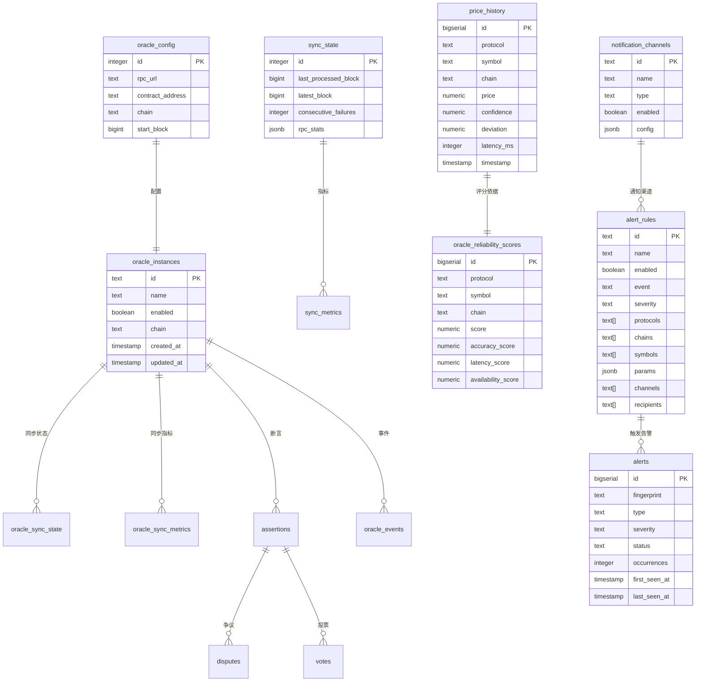

# 数据库设计

本文档详细描述 Insight 系统的数据库设计。

## 目录

- [数据库架构概述](#数据库架构概述)
- [Drizzle ORM 使用说明](#drizzle-orm-使用说明)
- [主要表结构](#主要表结构)
- [索引设计](#索引设计)
- [数据迁移策略](#数据迁移策略)

---

## 数据库架构概述

Insight 系统使用 **PostgreSQL** 作为主要数据库，托管在 **Supabase** 平台上。数据库访问通过 **Drizzle ORM** 进行，提供类型安全的数据库操作。

### 技术栈

- **数据库**: PostgreSQL 15+
- **托管平台**: Supabase
- **ORM**: Drizzle ORM
- **配置文件**: `drizzle.config.ts`

### 数据库文件结构

```
src/lib/database/
├── index.ts              # 数据库导出入口
├── schema.ts             # Schema 初始化
├── db.ts                 # 数据库连接
├── DbInitializer.ts      # 数据库初始化器
├── types.ts              # 数据库类型定义
├── coreTables.ts         # 核心表定义
├── priceHistoryTables.ts # 价格历史表
├── monitoringTables.ts   # 监控表（告警、审计等）
├── reliabilityTables.ts  # 可靠性评分表
├── api3Tables.ts         # API3 专用表
├── bandTables.ts         # Band Protocol 专用表
├── umaTables.ts          # UMA 专用表
├── utilityTables.ts      # 工具表
└── healthCheckTables.ts  # 健康检查表
```

---

## Drizzle ORM 使用说明

### 配置文件

`drizzle.config.ts` 配置 Drizzle ORM 的基本设置：

```typescript
import type { Config } from 'drizzle-kit';

export default {
  schema: './src/lib/database/index.ts',
  out: './drizzle',
  dialect: 'postgresql',
  dbCredentials: {
    url: process.env.DATABASE_URL || '',
  },
} satisfies Config;
```

### 数据库初始化

系统使用自定义的初始化流程，通过 `ensureSchema()` 函数确保所有表和索引都正确创建：

1. 创建核心表（coreTables）
2. 创建 UMA 专用表（umaTables）
3. 创建监控表（monitoringTables）
4. 创建工具表（utilityTables）
5. 创建价格历史表（priceHistoryTables）
6. 创建可靠性评分表（reliabilityTables）
7. 创建 API3 专用表（api3Tables）
8. 创建 Band Protocol 专用表（bandTables）
9. 创建所有索引
10. 运行数据迁移
11. 插入初始数据

### Drizzle ORM 的优势

- **类型安全**: 完全的 TypeScript 类型支持
- **轻量级**: 无额外运行时开销
- **声明式 Schema**: 使用 TypeScript 定义表结构
- **优秀的性能**: 直接生成 SQL，无抽象层
- **迁移系统**: 内置迁移支持
- **SQL 优先**: 可以直接编写 SQL 查询

---

## ER 图



---

## 主要表结构

### 核心表

#### oracle_config

预言机全局配置表（单行配置）。

| 字段                  | 类型    | 说明           |
| --------------------- | ------- | -------------- |
| `id`                  | INTEGER | 主键，固定为 1 |
| `rpc_url`             | TEXT    | RPC 节点 URL   |
| `contract_address`    | TEXT    | 合约地址       |
| `chain`               | TEXT    | 区块链网络     |
| `start_block`         | BIGINT  | 起始区块号     |
| `max_block_range`     | INTEGER | 最大区块范围   |
| `voting_period_hours` | INTEGER | 投票期（小时） |
| `confirmation_blocks` | INTEGER | 确认区块数     |

---

#### oracle_instances

预言机实例表。

| 字段                  | 类型        | 说明           |
| --------------------- | ----------- | -------------- |
| `id`                  | TEXT        | 主键，实例 ID  |
| `name`                | TEXT        | 实例名称       |
| `enabled`             | BOOLEAN     | 是否启用       |
| `rpc_url`             | TEXT        | RPC 节点 URL   |
| `contract_address`    | TEXT        | 合约地址       |
| `chain`               | TEXT        | 区块链网络     |
| `start_block`         | BIGINT      | 起始区块号     |
| `max_block_range`     | INTEGER     | 最大区块范围   |
| `voting_period_hours` | INTEGER     | 投票期（小时） |
| `confirmation_blocks` | INTEGER     | 确认区块数     |
| `created_at`          | TIMESTAMPTZ | 创建时间       |
| `updated_at`          | TIMESTAMPTZ | 更新时间       |

---

#### sync_state

全局同步状态表（单行）。

| 字段                           | 类型        | 说明               |
| ------------------------------ | ----------- | ------------------ |
| `id`                           | INTEGER     | 主键，固定为 1     |
| `last_processed_block`         | BIGINT      | 上次处理的区块     |
| `latest_block`                 | BIGINT      | 最新区块           |
| `safe_block`                   | BIGINT      | 安全区块           |
| `last_success_processed_block` | BIGINT      | 上次成功处理的区块 |
| `consecutive_failures`         | INTEGER     | 连续失败次数       |
| `rpc_active_url`               | TEXT        | 当前活跃的 RPC URL |
| `rpc_stats`                    | JSONB       | RPC 统计数据       |
| `last_attempt_at`              | TIMESTAMPTZ | 上次尝试时间       |
| `last_success_at`              | TIMESTAMPTZ | 上次成功时间       |
| `last_duration_ms`             | INTEGER     | 上次耗时（毫秒）   |
| `last_error`                   | TEXT        | 上次错误           |

---

#### oracle_sync_state

每个预言机实例的同步状态。

| 字段                           | 类型        | 说明                  |
| ------------------------------ | ----------- | --------------------- |
| `instance_id`                  | TEXT        | 主键，实例 ID（外键） |
| `last_processed_block`         | BIGINT      | 上次处理的区块        |
| `latest_block`                 | BIGINT      | 最新区块              |
| `safe_block`                   | BIGINT      | 安全区块              |
| `last_success_processed_block` | BIGINT      | 上次成功处理的区块    |
| `consecutive_failures`         | INTEGER     | 连续失败次数          |
| `rpc_active_url`               | TEXT        | 当前活跃的 RPC URL    |
| `rpc_stats`                    | JSONB       | RPC 统计数据          |
| `last_attempt_at`              | TIMESTAMPTZ | 上次尝试时间          |
| `last_success_at`              | TIMESTAMPTZ | 上次成功时间          |
| `last_duration_ms`             | INTEGER     | 上次耗时（毫秒）      |
| `last_error`                   | TEXT        | 上次错误              |

---

#### sync_metrics

全局同步指标历史。

| 字段                   | 类型        | 说明           |
| ---------------------- | ----------- | -------------- |
| `id`                   | BIGSERIAL   | 主键           |
| `recorded_at`          | TIMESTAMPTZ | 记录时间       |
| `last_processed_block` | BIGINT      | 上次处理的区块 |
| `latest_block`         | BIGINT      | 最新区块       |
| `safe_block`           | BIGINT      | 安全区块       |
| `lag_blocks`           | BIGINT      | 滞后区块数     |
| `duration_ms`          | INTEGER     | 耗时（毫秒）   |
| `error`                | TEXT        | 错误信息       |

---

#### oracle_sync_metrics

每个预言机实例的同步指标历史。

| 字段                   | 类型        | 说明            |
| ---------------------- | ----------- | --------------- |
| `id`                   | BIGSERIAL   | 主键            |
| `instance_id`          | TEXT        | 实例 ID（外键） |
| `recorded_at`          | TIMESTAMPTZ | 记录时间        |
| `last_processed_block` | BIGINT      | 上次处理的区块  |
| `latest_block`         | BIGINT      | 最新区块        |
| `safe_block`           | BIGINT      | 安全区块        |
| `lag_blocks`           | BIGINT      | 滞后区块数      |
| `duration_ms`          | INTEGER     | 耗时（毫秒）    |
| `error`                | TEXT        | 错误信息        |

---

### UMA 相关表

#### assertions

断言表（UMA 乐观预言机）。

| 字段                    | 类型        | 说明           |
| ----------------------- | ----------- | -------------- |
| `id`                    | TEXT        | 主键，断言 ID  |
| `instance_id`           | TEXT        | 实例 ID        |
| `chain`                 | TEXT        | 区块链网络     |
| `asserter`              | TEXT        | 断言者地址     |
| `protocol`              | TEXT        | 协议名称       |
| `market`                | TEXT        | 市场标识       |
| `assertion_data`        | TEXT        | 断言数据       |
| `asserted_at`           | TIMESTAMPTZ | 断言时间       |
| `liveness_ends_at`      | TIMESTAMPTZ | 活跃期结束时间 |
| `block_number`          | BIGINT      | 区块号         |
| `log_index`             | INTEGER     | 日志索引       |
| `resolved_at`           | TIMESTAMPTZ | 解决时间       |
| `settlement_resolution` | BOOLEAN     | 结算结果       |
| `status`                | TEXT        | 状态           |
| `bond_usd`              | NUMERIC     | 保证金（USD）  |
| `disputer`              | TEXT        | 争议者地址     |
| `tx_hash`               | TEXT        | 交易哈希       |

---

#### disputes

争议表。

| 字段             | 类型        | 说明            |
| ---------------- | ----------- | --------------- |
| `id`             | TEXT        | 主键，争议 ID   |
| `instance_id`    | TEXT        | 实例 ID         |
| `chain`          | TEXT        | 区块链网络      |
| `assertion_id`   | TEXT        | 断言 ID（外键） |
| `market`         | TEXT        | 市场标识        |
| `reason`         | TEXT        | 争议原因        |
| `disputer`       | TEXT        | 争议者地址      |
| `disputed_at`    | TIMESTAMPTZ | 争议时间        |
| `voting_ends_at` | TIMESTAMPTZ | 投票结束时间    |
| `tx_hash`        | TEXT        | 交易哈希        |
| `block_number`   | BIGINT      | 区块号          |
| `log_index`      | INTEGER     | 日志索引        |
| `status`         | TEXT        | 状态            |
| `votes_for`      | NUMERIC     | 赞成票数        |
| `votes_against`  | NUMERIC     | 反对票数        |
| `total_votes`    | NUMERIC     | 总票数          |

---

#### votes

投票表。

| 字段           | 类型        | 说明            |
| -------------- | ----------- | --------------- |
| `id`           | BIGSERIAL   | 主键            |
| `instance_id`  | TEXT        | 实例 ID         |
| `chain`        | TEXT        | 区块链网络      |
| `assertion_id` | TEXT        | 断言 ID（外键） |
| `voter`        | TEXT        | 投票者地址      |
| `support`      | BOOLEAN     | 是否赞成        |
| `weight`       | NUMERIC     | 投票权重        |
| `tx_hash`      | TEXT        | 交易哈希        |
| `block_number` | BIGINT      | 区块号          |
| `log_index`    | INTEGER     | 日志索引        |
| `created_at`   | TIMESTAMPTZ | 创建时间        |

---

#### oracle_events

预言机事件表。

| 字段               | 类型        | 说明       |
| ------------------ | ----------- | ---------- |
| `id`               | BIGSERIAL   | 主键       |
| `instance_id`      | TEXT        | 实例 ID    |
| `chain`            | TEXT        | 区块链网络 |
| `event_type`       | TEXT        | 事件类型   |
| `assertion_id`     | TEXT        | 断言 ID    |
| `tx_hash`          | TEXT        | 交易哈希   |
| `block_number`     | BIGINT      | 区块号     |
| `log_index`        | INTEGER     | 日志索引   |
| `payload`          | JSONB       | 事件负载   |
| `payload_checksum` | TEXT        | 负载校验和 |
| `created_at`       | TIMESTAMPTZ | 创建时间   |

---

### 价格历史表

#### price_history

价格历史表，存储所有预言机协议的价格数据。

| 字段           | 类型        | 说明                  |
| -------------- | ----------- | --------------------- |
| `id`           | BIGSERIAL   | 主键                  |
| `protocol`     | TEXT        | 协议名称              |
| `symbol`       | TEXT        | 交易对符号            |
| `chain`        | TEXT        | 区块链网络            |
| `price`        | NUMERIC     | 价格                  |
| `confidence`   | NUMERIC     | 置信区间（Pyth 专用） |
| `source_price` | NUMERIC     | 源价格                |
| `deviation`    | NUMERIC     | 偏差值                |
| `latency_ms`   | INTEGER     | 延迟（毫秒）          |
| `timestamp`    | TIMESTAMPTZ | 价格时间戳            |
| `created_at`   | TIMESTAMPTZ | 记录创建时间          |

---

### 可靠性评分表

#### oracle_reliability_scores

预言机可靠性评分表。

| 字段                 | 类型        | 说明              |
| -------------------- | ----------- | ----------------- |
| `id`                 | BIGSERIAL   | 主键              |
| `protocol`           | TEXT        | 协议名称          |
| `symbol`             | TEXT        | 交易对符号        |
| `chain`              | TEXT        | 区块链网络        |
| `score`              | NUMERIC     | 综合评分（0-100） |
| `accuracy_score`     | NUMERIC     | 准确性评分        |
| `latency_score`      | NUMERIC     | 延迟评分          |
| `availability_score` | NUMERIC     | 可用性评分        |
| `deviation_avg`      | NUMERIC     | 平均偏差          |
| `deviation_max`      | NUMERIC     | 最大偏差          |
| `deviation_min`      | NUMERIC     | 最小偏差          |
| `latency_avg_ms`     | NUMERIC     | 平均延迟（毫秒）  |
| `success_count`      | INTEGER     | 成功次数          |
| `total_count`        | INTEGER     | 总次数            |
| `sample_count`       | INTEGER     | 样本数量          |
| `period_start`       | TIMESTAMPTZ | 评分周期开始时间  |
| `period_end`         | TIMESTAMPTZ | 评分周期结束时间  |
| `calculated_at`      | TIMESTAMPTZ | 计算时间          |

---

### 监控表

#### alerts

告警表，存储触发的告警事件。

| 字段              | 类型        | 说明                 |
| ----------------- | ----------- | -------------------- |
| `id`              | BIGSERIAL   | 主键                 |
| `fingerprint`     | TEXT        | 告警指纹（唯一标识） |
| `type`            | TEXT        | 告警类型             |
| `severity`        | TEXT        | 严重程度             |
| `title`           | TEXT        | 告警标题             |
| `message`         | TEXT        | 告警消息             |
| `entity_type`     | TEXT        | 实体类型             |
| `entity_id`       | TEXT        | 实体 ID              |
| `status`          | TEXT        | 状态（Open/Closed）  |
| `occurrences`     | INTEGER     | 发生次数             |
| `first_seen_at`   | TIMESTAMPTZ | 首次发现时间         |
| `last_seen_at`    | TIMESTAMPTZ | 最近发现时间         |
| `acknowledged_at` | TIMESTAMPTZ | 确认时间             |
| `resolved_at`     | TIMESTAMPTZ | 解决时间             |
| `created_at`      | TIMESTAMPTZ | 创建时间             |
| `updated_at`      | TIMESTAMPTZ | 更新时间             |

---

#### alert_rules

告警规则表，定义告警触发条件。

| 字段                         | 类型        | 说明             |
| ---------------------------- | ----------- | ---------------- |
| `id`                         | TEXT        | 主键，规则 ID    |
| `name`                       | TEXT        | 规则名称         |
| `enabled`                    | BOOLEAN     | 是否启用         |
| `event`                      | TEXT        | 触发事件         |
| `severity`                   | TEXT        | 严重程度         |
| `protocols`                  | TEXT[]      | 适用的协议列表   |
| `chains`                     | TEXT[]      | 适用的链列表     |
| `instances`                  | TEXT[]      | 适用的实例列表   |
| `symbols`                    | TEXT[]      | 适用的交易对列表 |
| `params`                     | JSONB       | 规则参数         |
| `channels`                   | TEXT[]      | 通知渠道 ID 列表 |
| `recipients`                 | TEXT[]      | 接收者列表       |
| `cooldown_minutes`           | INTEGER     | 冷却时间（分钟） |
| `max_notifications_per_hour` | INTEGER     | 每小时最大通知数 |
| `runbook`                    | TEXT        | 操作手册链接     |
| `owner`                      | TEXT        | 负责人           |
| `silenced_until`             | TIMESTAMPTZ | 静默截止时间     |
| `created_at`                 | TIMESTAMPTZ | 创建时间         |
| `updated_at`                 | TIMESTAMPTZ | 更新时间         |

---

#### notification_channels

通知渠道配置表。

| 字段           | 类型        | 说明                               |
| -------------- | ----------- | ---------------------------------- |
| `id`           | TEXT        | 主键，渠道 ID                      |
| `name`         | TEXT        | 渠道名称                           |
| `type`         | TEXT        | 渠道类型（email/telegram/webhook） |
| `enabled`      | BOOLEAN     | 是否启用                           |
| `config`       | JSONB       | 渠道配置                           |
| `description`  | TEXT        | 描述                               |
| `created_at`   | TIMESTAMPTZ | 创建时间                           |
| `updated_at`   | TIMESTAMPTZ | 更新时间                           |
| `last_used_at` | TIMESTAMPTZ | 最后使用时间                       |
| `test_status`  | TEXT        | 测试状态                           |
| `test_message` | TEXT        | 测试消息                           |

---

#### audit_log

审计日志表。

| 字段          | 类型        | 说明     |
| ------------- | ----------- | -------- |
| `id`          | BIGSERIAL   | 主键     |
| `actor`       | TEXT        | 操作者   |
| `action`      | TEXT        | 操作类型 |
| `entity_type` | TEXT        | 实体类型 |
| `entity_id`   | TEXT        | 实体 ID  |
| `details`     | JSONB       | 详细信息 |
| `created_at`  | TIMESTAMPTZ | 创建时间 |

---

#### rate_limits

速率限制表。

| 字段       | 类型        | 说明         |
| ---------- | ----------- | ------------ |
| `key`      | TEXT        | 主键，限制键 |
| `reset_at` | TIMESTAMPTZ | 重置时间     |
| `count`    | INTEGER     | 当前计数     |

---

#### web_vitals_metrics

Web Vitals 性能指标表。

| 字段         | 类型        | 说明                      |
| ------------ | ----------- | ------------------------- |
| `id`         | BIGSERIAL   | 主键                      |
| `lcp`        | NUMERIC     | Largest Contentful Paint  |
| `fid`        | NUMERIC     | First Input Delay         |
| `cls`        | NUMERIC     | Cumulative Layout Shift   |
| `fcp`        | NUMERIC     | First Contentful Paint    |
| `ttfb`       | NUMERIC     | Time to First Byte        |
| `inp`        | NUMERIC     | Interaction to Next Paint |
| `page_path`  | TEXT        | 页面路径                  |
| `user_agent` | TEXT        | 用户代理                  |
| `timestamp`  | TIMESTAMPTZ | 记录时间                  |
| `created_at` | TIMESTAMPTZ | 创建时间                  |

---

#### oracle_config_history

预言机配置历史表。

| 字段              | 类型        | 说明     |
| ----------------- | ----------- | -------- |
| `id`              | BIGSERIAL   | 主键     |
| `instance_id`     | TEXT        | 实例 ID  |
| `changed_by`      | TEXT        | 变更者   |
| `change_type`     | TEXT        | 变更类型 |
| `previous_values` | JSONB       | 变更前值 |
| `new_values`      | JSONB       | 变更后值 |
| `change_reason`   | TEXT        | 变更原因 |
| `created_at`      | TIMESTAMPTZ | 创建时间 |

---

### API3 专用表

#### airnodes

API3 Airnode 表。

| 字段                | 类型        | 说明             |
| ------------------- | ----------- | ---------------- |
| `id`                | SERIAL      | 主键             |
| `airnode_address`   | TEXT        | Airnode 地址     |
| `endpoint_id`       | TEXT        | 端点 ID          |
| `sponsor_address`   | TEXT        | 赞助者地址       |
| `chain`             | TEXT        | 区块链网络       |
| `status`            | TEXT        | 状态             |
| `last_seen_at`      | TIMESTAMPTZ | 最后在线时间     |
| `response_time_ms`  | INTEGER     | 响应时间（毫秒） |
| `uptime_percentage` | NUMERIC     | 在线率           |
| `config`            | JSONB       | 配置             |
| `created_at`        | TIMESTAMPTZ | 创建时间         |
| `updated_at`        | TIMESTAMPTZ | 更新时间         |

---

#### dapis

API3 dAPI 表。

| 字段              | 类型        | 说明         |
| ----------------- | ----------- | ------------ |
| `id`              | SERIAL      | 主键         |
| `dapi_name`       | TEXT        | dAPI 名称    |
| `data_feed_id`    | TEXT        | 数据源 ID    |
| `airnode_address` | TEXT        | Airnode 地址 |
| `chain`           | TEXT        | 区块链网络   |
| `symbol`          | TEXT        | 交易对符号   |
| `decimals`        | INTEGER     | 小数位数     |
| `status`          | TEXT        | 状态         |
| `last_price`      | NUMERIC     | 最新价格     |
| `last_updated_at` | TIMESTAMPTZ | 最后更新时间 |
| `created_at`      | TIMESTAMPTZ | 创建时间     |
| `updated_at`      | TIMESTAMPTZ | 更新时间     |

---

#### oev_events

API3 OEV 事件表。

| 字段               | 类型        | 说明       |
| ------------------ | ----------- | ---------- |
| `id`               | SERIAL      | 主键       |
| `dapi_name`        | TEXT        | dAPI 名称  |
| `chain`            | TEXT        | 区块链网络 |
| `block_number`     | BIGINT      | 区块号     |
| `transaction_hash` | TEXT        | 交易哈希   |
| `oev_value`        | NUMERIC     | OEV 值     |
| `price_before`     | NUMERIC     | 变更前价格 |
| `price_after`      | NUMERIC     | 变更后价格 |
| `timestamp`        | TIMESTAMPTZ | 时间戳     |
| `metadata`         | JSONB       | 元数据     |
| `created_at`       | TIMESTAMPTZ | 创建时间   |

---

#### api3_price_history

API3 价格历史表。

| 字段              | 类型        | 说明         |
| ----------------- | ----------- | ------------ |
| `id`              | SERIAL      | 主键         |
| `dapi_name`       | TEXT        | dAPI 名称    |
| `chain`           | TEXT        | 区块链网络   |
| `symbol`          | TEXT        | 交易对符号   |
| `price`           | NUMERIC     | 价格         |
| `ema_price`       | NUMERIC     | EMA 价格     |
| `timestamp`       | TIMESTAMPTZ | 时间戳       |
| `data_feed_id`    | TEXT        | 数据源 ID    |
| `signature_valid` | BOOLEAN     | 签名是否有效 |
| `created_at`      | TIMESTAMPTZ | 创建时间     |

---

### Band Protocol 专用表

#### band_bridges

Band Protocol 跨链桥表。

| 字段                | 类型         | 说明             |
| ------------------- | ------------ | ---------------- |
| `id`                | SERIAL       | 主键             |
| `bridge_id`         | VARCHAR(100) | 桥 ID            |
| `source_chain`      | VARCHAR(50)  | 源链             |
| `destination_chain` | VARCHAR(50)  | 目标链           |
| `status`            | VARCHAR(20)  | 状态             |
| `last_transfer_at`  | TIMESTAMPTZ  | 最后转账时间     |
| `total_transfers`   | BIGINT       | 总转账次数       |
| `total_volume`      | NUMERIC      | 总成交量         |
| `avg_latency_ms`    | INTEGER      | 平均延迟（毫秒） |
| `success_rate`      | NUMERIC      | 成功率           |
| `config`            | JSONB        | 配置             |
| `created_at`        | TIMESTAMPTZ  | 创建时间         |
| `updated_at`        | TIMESTAMPTZ  | 更新时间         |

---

#### band_data_sources

Band Protocol 数据源表。

| 字段                      | 类型         | 说明           |
| ------------------------- | ------------ | -------------- |
| `id`                      | SERIAL       | 主键           |
| `source_id`               | VARCHAR(100) | 数据源 ID      |
| `name`                    | VARCHAR(100) | 名称           |
| `symbol`                  | VARCHAR(20)  | 交易对符号     |
| `chain`                   | VARCHAR(50)  | 区块链网络     |
| `source_type`             | VARCHAR(50)  | 数据源类型     |
| `status`                  | VARCHAR(20)  | 状态           |
| `update_interval_seconds` | INTEGER      | 更新间隔（秒） |
| `last_update_at`          | TIMESTAMPTZ  | 最后更新时间   |
| `reliability_score`       | NUMERIC      | 可靠性评分     |
| `config`                  | JSONB        | 配置           |
| `created_at`              | TIMESTAMPTZ  | 创建时间       |
| `updated_at`              | TIMESTAMPTZ  | 更新时间       |

---

#### band_transfers

Band Protocol 转账记录表。

| 字段                  | 类型         | 说明         |
| --------------------- | ------------ | ------------ |
| `id`                  | SERIAL       | 主键         |
| `transfer_id`         | VARCHAR(100) | 转账 ID      |
| `bridge_id`           | VARCHAR(100) | 桥 ID        |
| `source_chain`        | VARCHAR(50)  | 源链         |
| `destination_chain`   | VARCHAR(50)  | 目标链       |
| `symbol`              | VARCHAR(20)  | 交易对符号   |
| `amount`              | NUMERIC      | 转账金额     |
| `status`              | VARCHAR(20)  | 状态         |
| `source_tx_hash`      | VARCHAR(66)  | 源交易哈希   |
| `destination_tx_hash` | VARCHAR(66)  | 目标交易哈希 |
| `latency_ms`          | INTEGER      | 延迟（毫秒） |
| `timestamp`           | TIMESTAMPTZ  | 时间戳       |
| `metadata`            | JSONB        | 元数据       |
| `created_at`          | TIMESTAMPTZ  | 创建时间     |

---

#### band_price_history

Band Protocol 价格历史表。

| 字段                | 类型        | 说明         |
| ------------------- | ----------- | ------------ |
| `id`                | SERIAL      | 主键         |
| `symbol`            | VARCHAR(20) | 交易对符号   |
| `chain`             | VARCHAR(50) | 区块链网络   |
| `price`             | NUMERIC     | 价格         |
| `request_id`        | BIGINT      | 请求 ID      |
| `timestamp`         | TIMESTAMPTZ | 时间戳       |
| `sources_count`     | INTEGER     | 数据源数量   |
| `aggregation_valid` | BOOLEAN     | 聚合是否有效 |
| `created_at`        | TIMESTAMPTZ | 创建时间     |

---

## 索引设计

### 核心索引

| 索引名                             | 表                    | 字段                            | 用途               |
| ---------------------------------- | --------------------- | ------------------------------- | ------------------ |
| `idx_oracle_instances_enabled`     | `oracle_instances`    | `enabled`                       | 快速筛选启用的实例 |
| `idx_oracle_instances_chain`       | `oracle_instances`    | `chain`                         | 按链筛选实例       |
| `idx_sync_metrics_recorded_at`     | `sync_metrics`        | `recorded_at`                   | 按时间查询同步指标 |
| `idx_oracle_sync_metrics_instance` | `oracle_sync_metrics` | `instance_id, recorded_at DESC` | 实例的时序指标     |
| `idx_assertions_instance_chain`    | `assertions`          | `instance_id, chain`            | 实例和链的断言     |
| `idx_assertions_status`            | `assertions`          | `status`                        | 按状态筛选断言     |
| `idx_assertions_asserted_at`       | `assertions`          | `asserted_at DESC`              | 按时间查询断言     |
| `idx_disputes_assertion`           | `disputes`            | `assertion_id`                  | 查询断言的争议     |
| `idx_votes_assertion`              | `votes`               | `assertion_id`                  | 查询断言的投票     |
| `idx_oracle_events_instance_chain` | `oracle_events`       | `instance_id, chain`            | 实例和链的事件     |
| `idx_oracle_events_type`           | `oracle_events`       | `event_type`                    | 按事件类型筛选     |
| `idx_oracle_events_created_at`     | `oracle_events`       | `created_at DESC`               | 按时间查询事件     |

### 价格历史索引

| 索引名                                   | 表              | 字段                               | 用途               |
| ---------------------------------------- | --------------- | ---------------------------------- | ------------------ |
| `idx_price_history_protocol_symbol`      | `price_history` | `protocol, symbol`                 | 按协议和符号筛选   |
| `idx_price_history_timestamp`            | `price_history` | `timestamp DESC`                   | 按时间查询价格历史 |
| `idx_price_history_protocol_symbol_time` | `price_history` | `protocol, symbol, timestamp DESC` | 复合索引优化查询   |
| `idx_price_history_chain`                | `price_history` | `chain`                            | 按链筛选价格       |

### 可靠性评分索引

| 索引名                            | 表                          | 字段                       | 用途             |
| --------------------------------- | --------------------------- | -------------------------- | ---------------- |
| `idx_reliability_protocol`        | `oracle_reliability_scores` | `protocol`                 | 按协议筛选评分   |
| `idx_reliability_protocol_symbol` | `oracle_reliability_scores` | `protocol, symbol`         | 按协议和符号筛选 |
| `idx_reliability_period`          | `oracle_reliability_scores` | `period_start, period_end` | 按周期筛选       |
| `idx_reliability_chain`           | `oracle_reliability_scores` | `chain`                    | 按链筛选评分     |

### 监控索引

| 索引名                           | 表                      | 字段                | 用途               |
| -------------------------------- | ----------------------- | ------------------- | ------------------ |
| `idx_alerts_status`              | `alerts`                | `status`            | 按状态筛选告警     |
| `idx_alerts_last_seen`           | `alerts`                | `last_seen_at DESC` | 按时间排序告警     |
| `idx_alerts_type`                | `alerts`                | `type`              | 按类型筛选告警     |
| `idx_alerts_severity`            | `alerts`                | `severity`          | 按严重程度筛选告警 |
| `idx_alert_rules_enabled`        | `alert_rules`           | `enabled`           | 筛选启用的规则     |
| `idx_alert_rules_event`          | `alert_rules`           | `event`             | 按事件筛选规则     |
| `idx_notification_channels_type` | `notification_channels` | `type`              | 按类型筛选渠道     |
| `idx_audit_created`              | `audit_log`             | `created_at DESC`   | 按时间查询审计日志 |

### API3 索引

| 索引名                                  | 表                   | 字段                   | 用途                 |
| --------------------------------------- | -------------------- | ---------------------- | -------------------- |
| `idx_airnodes_chain`                    | `airnodes`           | `chain`                | 按链筛选 Airnode     |
| `idx_airnodes_status`                   | `airnodes`           | `status`               | 按状态筛选 Airnode   |
| `idx_dapis_chain_symbol`                | `dapis`              | `chain, symbol`        | 按链和符号筛选 dAPI  |
| `idx_dapis_status`                      | `dapis`              | `status`               | 按状态筛选 dAPI      |
| `idx_oev_events_dapi_chain`             | `oev_events`         | `dapi_name, chain`     | 按 dAPI 和链筛选事件 |
| `idx_oev_events_timestamp`              | `oev_events`         | `timestamp DESC`       | 按时间查询 OEV 事件  |
| `idx_api3_price_history_dapi_timestamp` | `api3_price_history` | `dapi_name, timestamp` | 按 dAPI 和时间查询   |

### Band Protocol 索引

| 索引名                                    | 表                   | 字段                              | 用途                 |
| ----------------------------------------- | -------------------- | --------------------------------- | -------------------- |
| `idx_band_bridges_source_dest`            | `band_bridges`       | `source_chain, destination_chain` | 按源链和目标链筛选   |
| `idx_band_bridges_status`                 | `band_bridges`       | `status`                          | 按状态筛选桥         |
| `idx_band_data_sources_chain_symbol`      | `band_data_sources`  | `chain, symbol`                   | 按链和符号筛选数据源 |
| `idx_band_data_sources_status`            | `band_data_sources`  | `status`                          | 按状态筛选数据源     |
| `idx_band_transfers_bridge_id`            | `band_transfers`     | `bridge_id`                       | 按桥 ID 筛选转账     |
| `idx_band_transfers_timestamp`            | `band_transfers`     | `timestamp DESC`                  | 按时间查询转账       |
| `idx_band_price_history_symbol_timestamp` | `band_price_history` | `symbol, timestamp`               | 按符号和时间查询     |

---

## 数据迁移策略

### 迁移框架

系统使用自定义的初始化流程，配合 Drizzle ORM 进行数据库管理：

- `ensureSchema()` - 主入口函数，确保所有表和索引存在
- `create*Tables()` - 创建各类表
- `create*Indexes()` - 创建各类索引
- `runCoreMigrations()` - 运行核心迁移
- `insert*InitialData()` - 插入初始数据

### Drizzle 迁移命令

```bash
# 生成迁移
npx drizzle-kit generate

# 应用迁移
npx drizzle-kit push

# 查看迁移状态
npx drizzle-kit studio
```

### 迁移流程

1. **检查表是否存在**
   - 使用 `CREATE TABLE IF NOT EXISTS`
   - 避免重复创建

2. **创建索引**
   - 使用 `CREATE INDEX IF NOT EXISTS`
   - 按需添加新索引

3. **运行迁移**
   - 版本化迁移脚本
   - 事务保证原子性
   - 失败时自动回滚

4. **插入初始数据**
   - 配置数据
   - 参考数据

### 迁移最佳实践

- **向后兼容**: 迁移不应破坏现有功能
- **可回滚**: 重要迁移应有回滚方案
- **测试**: 在测试环境验证迁移
- **备份**: 迁移前备份数据库
- **小步迭代**: 拆分大型迁移为小步骤

### Drizzle ORM 迁移优势

- **类型安全**: 迁移基于 TypeScript 类型定义
- **自动生成**: 可以从 schema 自动生成迁移
- **版本控制**: 迁移文件纳入版本控制
- **回滚支持**: 支持迁移回滚
- **Schema 对比**: 可以对比 schema 差异

---

**返回 [文档总索引](../README.md)**
