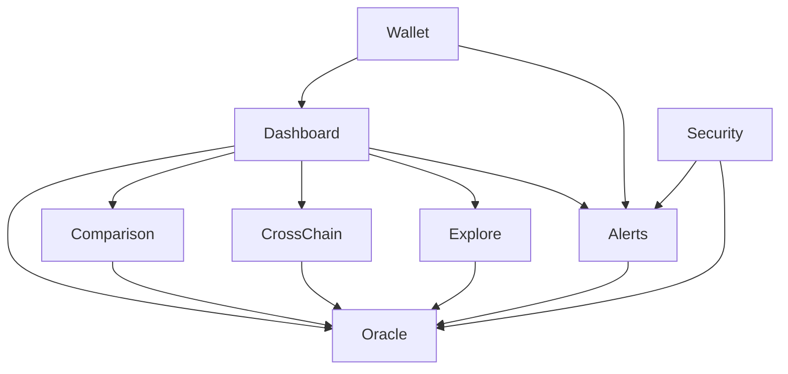

# 模块设计文档

本文档详细描述 Insight 系统各模块的设计。

## 目录

- [核心模块列表](#核心模块列表)
- [模块职责说明](#模块职责说明)
- [模块间接口定义](#模块间接口定义)
- [依赖关系](#依赖关系)

---

## 核心模块列表

Insight 平台采用功能模块化设计，主要包含以下核心模块：

| 模块           | 路径                        | 职责           |
| -------------- | --------------------------- | -------------- |
| **Dashboard**  | `src/features/dashboard/`   | 主仪表板       |
| **Oracle**     | `src/features/oracle/`      | 预言机数据管理 |
| **Comparison** | `src/features/comparison/`  | 价格比较       |
| **CrossChain** | `src/features/cross-chain/` | 跨链分析       |
| **Explore**    | `src/features/explore/`     | 数据探索       |
| **Alerts**     | `src/features/alerts/`      | 告警系统       |
| **Security**   | `src/features/security/`    | 安全与异常检测 |
| **Wallet**     | `src/features/wallet/`      | 钱包连接       |

---

## 模块职责说明

### Dashboard 模块

\*\*路径: `src/features/dashboard/`

**职责**:

- 提供统一的仪表板视图
- 展示关键指标卡片
- 集成实时价格图表
- 提供快速操作入口

**主要组件**:

- `ProfessionalDashboard.tsx` - 专业仪表板组件
- `KPICards.tsx` - KPI 指标卡片
- `PriceHistoryChart.tsx` - 价格历史图表
- `QuickActionsPanel.tsx` - 快速操作面板

**主要 Hooks**:

- `useDashboard.ts` - 仪表板数据获取与状态管理

---

### Oracle 模块

**路径**: `src/features/oracle/`

**职责**:

- 预言机数据聚合与管理
- 偏差分析
- 争议分析
- 协议对比

**子模块**:

#### Analytics (偏差分析)

**路径**: `src/features/oracle/analytics/deviation/`

- 实时偏差监控
- 偏差趋势分析
- 异常检测
- 数据导出

**主要组件**:

- `DeviationContent.tsx` - 偏差分析主界面
- `DeviationHeatmap.tsx` - 偏差热力图
- `DeviationTrendChart.tsx` - 偏差趋势图
- `AnomalyList.tsx` - 异常列表

**主要 Hooks**:

- `useDeviationAnalytics.ts` - 偏差分析数据管理

#### Disputes (争议分析)

**路径**: `src/features/oracle/analytics/disputes/`

- 争议历史查看
- 争议趋势分析
- 保证金分布分析

**主要组件**:

- `DisputeContent.tsx` - 争议分析主界面
- `DisputeList.tsx` - 争议列表
- `BondDistributionChart.tsx` - 保证金分布图

**主要 Hooks**:

- `useDisputeAnalytics.ts` - 争议分析数据管理

#### Dashboard (预言机仪表板)

**路径**: `src/features/oracle/dashboard/`

- 预言机协议概览
- 价格源列表
- 协议健康状态

**主要服务**:

- `priceFetcher.ts` - 价格获取服务
- `priceDeviationAnalytics.ts` - 偏差分析服务
- `unifiedPriceService.ts` - 统一价格服务
- `syncFramework.ts` - 数据同步框架

#### API3 子模块

**路径**: `src/features/oracle/api3/`

- Airnode 监控
- dAPIs 价格分析
- OEV 监控
- 跨链价格比较

**主要组件**:

- `AirnodeDetail.tsx` - Airnode 详情
- `DapiList.tsx` - dAPI 列表
- `OevOverview.tsx` - OEV 概览

#### Band 子模块

**路径**: `src/features/oracle/band/`

- 数据源验证
- 跨链桥监控
- 聚合验证

**主要组件**:

- `DataSourceList.tsx` - 数据源列表
- `AggregationValidationCard.tsx` - 聚合验证

#### Pyth 子模块

**路径**: `src/features/oracle/pyth/`

- Publisher 监控
- 置信区间分析
- 价格更新统计

**主要组件**:

- `PublisherMonitor.tsx` - Publisher 监控
- `ConfidenceIntervalChart.tsx` - 置信区间图表

---

### Comparison 模块

**路径**: `src/features/comparison/`

**职责**:

- 多协议价格实时对比
- 偏差热力图
- 延迟分析

**主要组件**:

- `ComparisonContent.tsx` - 对比主界面
- `PriceHeatmap.tsx` - 价格热力图
- `LatencyAnalysis.tsx` - 延迟分析
- `RealtimeComparison.tsx` - 实时对比

**主要 Hooks**:

- `useComparison.ts` - 对比数据管理

---

### CrossChain 模块

**路径**: `src/features/cross-chain/`

**职责**:

- 跨链价格比较
- 相关性分析
- 价格一致性监控
- 流动性分析

**主要组件**:

- `CrossChainOverview.tsx` - 跨链概览
- `CrossChainComparison.tsx` - 跨链对比
- `CorrelationMatrix.tsx` - 相关性矩阵
- `PriceConsistencyMonitor.tsx` - 价格一致性监控
- `LiquidityDistribution.tsx` - 流动性分布

**主要 Hooks**:

- `useCrossChain.ts` - 跨链数据管理
- `usePriceConsistency.ts` - 价格一致性监控

---

### Explore 模块

**路径**: `src/features/explore/`

**职责**:

- 数据探索与搜索
- 市场概览
- 热门价格源
- 协议探索

**主要组件**:

- `MarketOverview.tsx` - 市场概览
- `TrendingFeeds.tsx` - 热门价格源
- `GlobalSearch.tsx` - 全局搜索
- `DataDiscovery.tsx` - 数据发现

**主要 Hooks**:

- `useMarketOverview.ts` - 市场概览数据
- `useGlobalSearch.ts` - 搜索功能
- `useTrendingFeeds.ts` - 热门价格源

---

### Alerts 模块

**路径**: `src/features/alerts/`

**职责**:

- 告警规则管理
- 告警通知发送
- 告警历史记录
- 响应时间统计

**主要组件**:

- `AlertRulesList.tsx` - 告警规则列表
- `AlertRuleForm.tsx` - 告警规则表单
- `NotificationChannels.tsx` - 通知渠道配置
- `AlertTrendChart.tsx` - 告警趋势图

**主要 Hooks**:

- `useAlertRules.ts` - 告警规则管理
- `useAlerts.ts` - 告警数据
- `useNotificationChannels.ts` - 通知渠道

**主要工具**:

- `alertScoring.ts` - 告警评分

---

---

### Wallet 模块

**路径**: `src/features/wallet/`

**职责**:

- 钱包连接管理
- 用户身份管理

**主要组件**:

- `ConnectWallet.tsx` - 连接钱包
- `UserMenu.tsx` - 用户菜单

**主要 Context**:

- `WalletContext.tsx` - 钱包上下文

**主要 Hooks**:

- `useWallet.ts` - 钱包状态管理

---

### Security 模块

**路径**: `src/features/security/`

**职责**:

- 异常检测
- 威胁检测
- 安全监控

**主要服务**:

- `AnomalyDetectionService.ts` - 异常检测服务
- `StatisticalDetector.ts` - 统计检测器

---

## 模块间接口定义

### Oracle ↔ Comparison

**接口**:

- `getUnifiedPrice(symbol, protocols)` - 获取统一价格数据
- `calculateDeviation(prices)` - 计算价格偏差

### Oracle ↔ Alerts

**接口**:

- `subscribeToPriceUpdates(symbol, callback)` - 订阅价格更新
- `getLatestPrice(symbol, protocol)` - 获取最新价格

### CrossChain ↔ Oracle

**接口**:

- `getCrossChainPrices(symbol, chains)` - 获取跨链价格
- `calculateCorrelation(priceSeries1, priceSeries2)` - 计算相关性

### Explore ↔ Oracle

**接口**:

- `searchFeeds(query)` - 搜索价格源
- `getProtocolStats(protocol)` - 获取协议统计

---

## 依赖关系

**核心依赖**:

- 所有模块依赖 Oracle 模块获取预言机数据
- Dashboard 集成多个子模块功能
- Security 模块依赖 Oracle 和 Alerts 进行安全监控

---

**返回 [文档总索引](../README.md)**
