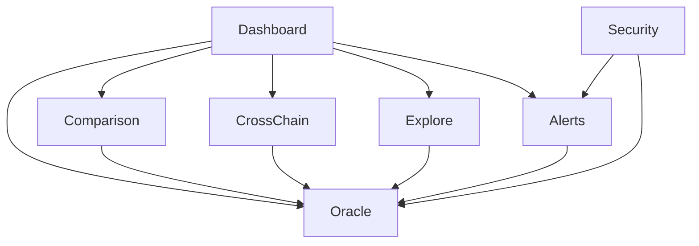

# 模块设计文档

本文档详细描述 Insight 系统各模块的设计。

## 目录

- [核心模块列表](#核心模块列表)
- [模块职责说明](#模块职责说明)
- [模块间接口定义](#模块间接口定义)
- [依赖关系](#依赖关系)

---

## 核心模块列表

Insight 平台采用功能模块化设计，主要包含以下核心模块：

| 模块           | 路径                        | 职责           |
| -------------- | --------------------------- | -------------- |
| **Dashboard**  | `src/features/dashboard/`   | 主仪表板       |
| **Oracle**     | `src/features/oracle/`      | 预言机数据管理 |
| **Comparison** | `src/features/comparison/`  | 价格比较       |
| **CrossChain** | `src/features/cross-chain/` | 跨链分析       |
| **Explore**    | `src/features/explore/`     | 数据探索       |
| **Alerts**     | `src/features/alerts/`      | 告警系统       |
| **Security**   | `src/features/security/`    | 安全与异常检测 |

---

## 模块职责说明

### Dashboard 模块

**路径**: `src/features/dashboard/`

**职责**:

- 提供统一的仪表板视图
- 展示关键指标卡片
- 集成实时价格图表
- 提供快速操作入口

**主要组件**:

- `Dashboard` 组件
- KPI 指标卡片
- 价格历史图表
- 快速操作面板

**主要 Hooks**:

- `useDashboard` - 仪表板数据获取与状态管理

---

### Oracle 模块

**路径**: `src/features/oracle/`

**职责**:

- 预言机数据聚合与管理
- 偏差分析
- 争议分析
- 协议对比
- 多协议支持（API3、Band、Chainlink、Pyth、UMA）

**子模块**:

#### Analytics (分析)

**路径**: `src/features/oracle/analytics/`

- **Deviation (偏差分析)**: `src/features/oracle/analytics/deviation/`
  - 实时偏差监控
  - 偏差趋势分析
  - 异常检测
  - 数据导出

- **Disputes (争议分析)**: `src/features/oracle/analytics/disputes/`
  - 争议历史查看
  - 争议趋势分析
  - 保证金分布分析

#### Dashboard (预言机仪表板)

**路径**: `src/features/oracle/dashboard/`

- 预言机协议概览
- 价格源列表
- 协议健康状态

**主要服务**:

- `priceFetcher.ts` - 价格获取服务
- `reliabilityScorer.ts` - 可靠性评分服务
- `syncFramework.ts` - 数据同步框架
- `apiCache.ts` - API 缓存服务
- `realtime/index.ts` - 实时数据服务

#### API3 子模块

**路径**: `src/features/oracle/api3/`

- Airnode 监控
- dAPIs 价格分析
- OEV 监控
- 跨链价格比较

**主要组件**:

- `AirnodeDetail.tsx` - Airnode 详情
- `DapiList.tsx` - dAPI 列表
- `Api3PriceChart.tsx` - API3 价格图表

#### Band 子模块

**路径**: `src/features/oracle/band/`

- 数据源验证
- 跨链桥监控
- 聚合验证

**主要组件**:

- `DataSourceList.tsx` - 数据源列表
- `BandPriceChart.tsx` - Band 价格图表
- `BridgeStatusCard.tsx` - 桥接状态卡片

#### Chainlink 子模块

**路径**: `src/features/oracle/chainlink/`

- Feeds 监控
- Operator 列表
- 偏差分析

**主要组件**:

- `FeedDetail.tsx` - Feed 详情
- `OperatorList.tsx` - Operator 列表

#### Pyth 子模块

**路径**: `src/features/oracle/pyth/`

- Publisher 监控
- 置信区间分析
- 价格更新统计

**主要组件**:

- Publisher 监控组件
- 置信区间图表

#### Reliability (可靠性) 子模块

**路径**: `src/features/oracle/reliability/`

- 可靠性评分计算
- 历史可靠性分析
- 多维度评估

---

### Comparison 模块

**路径**: `src/features/comparison/`

**职责**:

- 多协议价格实时对比
- 偏差热力图
- 延迟分析
- 成本效率分析

**主要组件**:

- `ComparisonContent.tsx` - 对比主界面
- `PriceHeatmap.tsx` - 价格热力图
- `LatencyAnalysis.tsx` - 延迟分析
- `RealtimeComparison.tsx` - 实时对比
- `ProtocolCompare.tsx` - 协议对比
- `CostEfficiency.tsx` - 成本效率分析
- `VirtualTable.tsx` - 虚拟表格

**主要 Hooks**:

- `useComparison.ts` - 对比数据管理
- `useComparisonPage.ts` - 对比页面管理
- `useProtocolMetrics.ts` - 协议指标管理

---

### CrossChain 模块

**路径**: `src/features/cross-chain/`

**职责**:

- 跨链价格比较
- 相关性分析
- 价格一致性监控
- 流动性分析
- 桥接状态监控

**主要组件**:

- `CrossChainOverview.tsx` - 跨链概览
- `CrossChainComparison.tsx` - 跨链对比
- `CorrelationMatrix.tsx` - 相关性矩阵
- `PriceConsistencyMonitor.tsx` - 价格一致性监控
- `LiquidityAnalysis.tsx` - 流动性分析
- `BridgeStatusCard.tsx` - 桥接状态卡片
- `RiskScore.tsx` - 风险评分

**主要 Hooks**:

- `useCrossChain.ts` - 跨链数据管理

---

### Explore 模块

**路径**: `src/features/explore/`

**职责**:

- 数据探索与搜索
- 市场概览
- 热门价格源
- 协议探索
- 收藏管理

**主要组件**:

- `MarketOverview.tsx` - 市场概览
- `TrendingFeeds.tsx` - 热门价格源
- `GlobalSearch.tsx` - 全局搜索
- `DataDiscovery.tsx` - 数据发现
- `MarketHealthScore.tsx` - 市场健康评分
- `RecentAnomalies.tsx` - 近期异常
- `FavoritesPanel.tsx` - 收藏面板

**主要 Hooks**:

- `useMarketOverview.ts` - 市场概览数据
- `useGlobalSearch.ts` - 搜索功能
- `useTrendingFeeds.ts` - 热门价格源
- `useDataDiscovery.ts` - 数据发现
- `useFavorites.ts` - 收藏管理
- `useHistory.ts` - 历史记录

---

### Alerts 模块

**路径**: `src/features/alerts/`

**职责**:

- 告警规则管理
- 告警通知发送
- 告警历史记录
- 响应时间统计
- 通知渠道配置

**主要组件**:

- `AlertRulesList.tsx` - 告警规则列表
- `AlertRuleForm.tsx` - 告警规则表单
- `NotificationChannels.tsx` - 通知渠道配置
- `AlertTrendChart.tsx` - 告警趋势图
- `AlertCard.tsx` - 告警卡片
- `AlertGroup.tsx` - 告警分组
- `AlertHeatmap.tsx` - 告警热力图
- `ResponseTimeStats.tsx` - 响应时间统计
- `EmailConfig.tsx` - 邮件配置
- `TelegramConfig.tsx` - Telegram 配置
- `WebhookConfig.tsx` - Webhook 配置

**主要 Hooks**:

- `useAlertRules.ts` - 告警规则管理
- `useAlerts.ts` - 告警数据
- `useNotificationChannels.ts` - 通知渠道
- `useAlertHistory.ts` - 告警历史
- `useAlertsFilter.ts` - 告警筛选
- `useAlertsPage.ts` - 告警页面管理
- `useAlertActions.ts` - 告警操作

**主要工具**:

- `alertScoring.ts` - 告警评分
- `normalize.ts` - 数据标准化

---

### Security 模块

**路径**: `src/features/security/`

**职责**:

- 异常检测
- 威胁检测
- 安全监控

**主要服务**:

- 异常检测服务
- 统计检测器

---

## 模块间接口定义

### Oracle ↔ Comparison

**接口**:

- `getUnifiedPrice(symbol, protocols)` - 获取统一价格数据
- `calculateDeviation(prices)` - 计算价格偏差

### Oracle ↔ Alerts

**接口**:

- `subscribeToPriceUpdates(symbol, callback)` - 订阅价格更新
- `getLatestPrice(symbol, protocol)` - 获取最新价格

### CrossChain ↔ Oracle

**接口**:

- `getCrossChainPrices(symbol, chains)` - 获取跨链价格
- `calculateCorrelation(priceSeries1, priceSeries2)` - 计算相关性

### Explore ↔ Oracle

**接口**:

- `searchFeeds(query)` - 搜索价格源
- `getProtocolStats(protocol)` - 获取协议统计

---

## 依赖关系

```mermaid
graph TD
    Dashboard[Dashboard] --> Oracle[Oracle]
    Dashboard --> Comparison[Comparison]
    Dashboard --> CrossChain[CrossChain]
    Dashboard --> Explore[Explore]
    Dashboard --> Alerts[Alerts]

    Comparison --> Oracle
    CrossChain --> Oracle
    Explore --> Oracle
    Alerts --> Oracle

    Security[Security] --> Oracle
    Security --> Alerts
```

**核心依赖**:

- 所有模块依赖 Oracle 模块获取预言机数据
- Dashboard 集成多个子模块功能
- Security 模块依赖 Oracle 和 Alerts 进行安全监控

---

**返回 [文档总索引](../README.md)**
