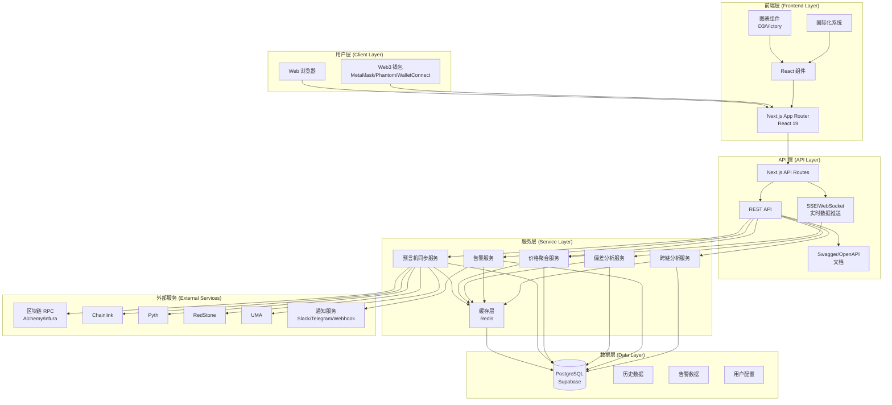

# 系统架构概述

本文档描述 Insight 预言机数据分析平台的整体系统架构。

## 系统架构图

## 分层架构说明

### 1. 用户层

- **Web 浏览器**: 用户通过现代浏览器访问应用
- **Web3 钱包**: 支持 MetaMask、Phantom、WalletConnect 等钱包连接

### 2. 前端层

- **Next.js App Router**: 使用 Next.js 16 的 App Router 架构
- **React 组件**: 功能模块化的 React 组件
- **图表组件**: 使用 D3 和 Victory 进行数据可视化
- **国际化系统**: 支持中英文多语言

### 3. API 层

- **Next.js API Routes**: 服务端 API 路由
- **REST API**: 标准的 RESTful API 接口
- **SSE/WebSocket**: 实时数据推送服务
- **Swagger/OpenAPI**: API 文档

### 4. 服务层

- **预言机同步服务**: 从各协议同步预言机数据
- **价格聚合服务**: 多协议价格聚合与处理
- **偏差分析服务**: 价格偏差检测与分析
- **告警服务**: 告警规则处理与通知
- **跨链分析服务**: 跨链数据分析
- **缓存层**: Redis 缓存提升性能

### 5. 数据层

- **PostgreSQL (Supabase)**: 主数据库
- **历史数据**: 价格和预言机历史数据
- **告警数据**: 告警规则和历史记录
- **用户配置**: 用户偏好和设置

### 6. 外部服务

- **区块链 RPC**: Alchemy、Infura 等 RPC 提供商
- **预言机协议**: Chainlink、Pyth、RedStone、UMA
- **通知服务**: Slack、Telegram、Webhook

## 主要功能模块

### 预言机数据聚合

- 支持 Chainlink、Pyth、RedStone、UMA 等协议
- 实时数据同步与历史数据存储
- 多协议数据统一格式化

### 价格偏差分析

- 实时价格偏差检测
- 趋势分析和异常识别
- 可视化图表展示

### 智能告警系统

- 灵活的告警规则配置
- 多渠道通知（邮件、Telegram、Webhook）
- 告警历史记录

### 跨链分析

- 多链价格比较
- 相关性分析
- 套利机会识别

### 数据探索

- 市场概览
- 热门价格源
- 协议和地址探索

## 技术选型理由

### Next.js 16

- 支持 App Router 架构，更灵活的路由组织
- 服务端组件与客户端组件分离，性能更好
- 内置 API Routes，无需额外后端服务
- 优秀的开发体验和部署支持

### TypeScript

- 类型安全，减少运行时错误
- 更好的 IDE 支持和代码提示
- 提高代码可维护性

### Tailwind CSS

- 实用优先的 CSS 框架，开发效率高
- 响应式设计支持
- 统一的设计系统

### Supabase (PostgreSQL)

- 开源的 Firebase 替代品
- 完整的 PostgreSQL 功能
- 内置认证、实时订阅、存储等功能
- 与 Vercel 部署集成良好

### Redis

- 高性能缓存
- 支持 WebSocket/SSE 状态管理
- 会话存储

---

**相关文档**:

- [模块设计](./modules.md)
- [数据流图](./data-flow.md)
- [数据库设计](./database.md)
