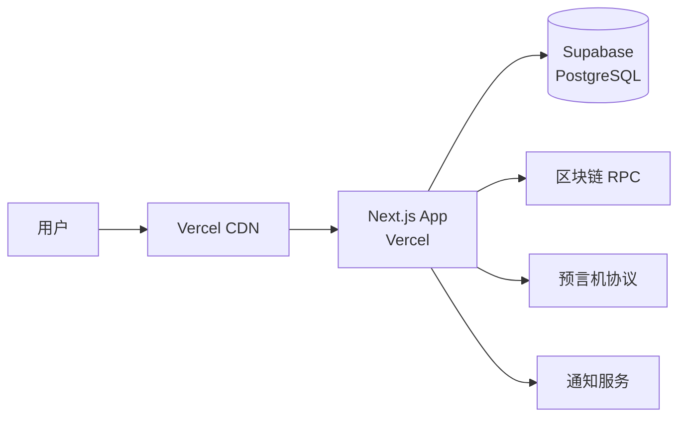

# 生产部署指南

本指南将帮助你在生产环境中部署 Insight 预言机数据分析平台。

## 部署架构

推荐使用 Vercel + Supabase 进行部署，这是官方支持的最佳实践：



## 前置要求

在开始部署之前，请确保你有：

1. **Vercel 账户** - 用于托管 Next.js 应用
2. **Supabase 账户** - 用于数据库和后端服务
3. **域名** - （可选但推荐）用于自定义域名
4. **RPC 提供商账户** - Alchemy、Infura 或其他
5. **通知服务** - Slack、Telegram 等（可选）

## 步骤 1: 设置 Supabase 生产环境

### 创建 Supabase 项目

1. 访问 [supabase.com](https://supabase.com) 并登录
2. 点击 "New Project" 创建新项目
3. 填写项目信息：
   - **项目名称**: Insight Production
   - **数据库密码**: 使用强密码（请保存！）
   - **区域**: 选择离你的用户最近的区域
4. 等待项目初始化（2-5 分钟）

### 配置数据库

1. 在 Supabase 仪表板中进入项目
2. 进入 "SQL Editor"
3. 运行数据库迁移脚本
4. 验证表结构已创建

### 获取 Supabase 凭证

进入 "Settings" → "API"，复制以下信息：

- Project URL
- anon public key
- service_role key
- Database URL（在 "Database" → "Connection Pooling" 中）

## 步骤 2: 准备代码仓库

确保你的代码已推送到 Git 仓库（GitHub、GitLab 或 Bitbucket）。

## 步骤 3: 在 Vercel 上部署

### 导入项目

1. 访问 [vercel.com](https://vercel.com) 并登录
2. 点击 "Add New..." → "Project"
3. 导入你的 Git 仓库
4. 配置项目设置：
   - **Project Name**: insight-production
   - **Framework Preset**: Next.js
   - **Root Directory**: ./（保持默认）

### 配置环境变量

在 Vercel 项目设置中，进入 "Environment Variables"，添加以下变量：

#### 必需变量

```env
# Supabase
NEXT_PUBLIC_SUPABASE_URL=https://[project-ref].supabase.co
NEXT_PUBLIC_SUPABASE_ANON_KEY=your-anon-key
SUPABASE_SERVICE_ROLE_KEY=your-service-role-key
DATABASE_URL=postgresql://...

# 应用
NEXT_PUBLIC_APP_URL=https://your-domain.com
NODE_ENV=production

# 安全
INSIGHT_ADMIN_TOKEN=your-strong-admin-token
INSIGHT_ADMIN_TOKEN_SALT=your-salt
JWT_SECRET=your-jwt-secret-at-least-32-chars

# RPC
ALCHEMY_API_KEY=your-alchemy-key
# 或
INFURA_API_KEY=your-infura-key
```

#### 可选变量

```env
# 日志
LOG_LEVEL=info

# Sentry
SENTRY_DSN=https://your-sentry-dsn
NEXT_PUBLIC_SENTRY_DSN=https://your-public-sentry-dsn

# 通知
INSIGHT_SLACK_WEBHOOK_URL=https://hooks.slack.com/...
INSIGHT_TELEGRAM_BOT_TOKEN=your-bot-token
INSIGHT_TELEGRAM_CHAT_ID=your-chat-id
```

**重要提示**:

- 确保 `NODE_ENV` 设置为 `production`
- 不要将敏感密钥提交到 Git
- 为生产环境生成新的密钥，不要重用开发环境的密钥

### 部署

1. 点击 "Deploy" 开始部署
2. 等待构建完成（通常 2-5 分钟）
3. 部署成功后，你会获得一个 `.vercel.app` 域名

## 步骤 4: 配置自定义域名（推荐）

### 添加域名

1. 在 Vercel 项目设置中进入 "Domains"
2. 点击 "Add" 添加你的域名
3. 输入域名（如 `insight.yourdomain.com`）
4. 按照提示配置 DNS 记录

### 配置 HTTPS

Vercel 会自动为你配置 SSL 证书，无需额外操作。

### 更新环境变量

将 `NEXT_PUBLIC_APP_URL` 更新为你的新域名：

```env
NEXT_PUBLIC_APP_URL=https://insight.yourdomain.com
```

## 步骤 5: 生产环境检查

在正式开放访问之前，请完成 [生产检查清单](../../PRODUCTION_CHECKLIST.md) 中的所有项目。

### 验证部署

#### 1. 健康检查

```bash
curl https://insight.yourdomain.com/api/health
```

应该返回：

```json
{
  "status": "healthy",
  "timestamp": "2024-01-01T00:00:00.000Z"
}
```

#### 2. 数据库连接

```bash
curl https://insight.yourdomain.com/api/health?probe=readiness
```

#### 3. 价格数据

```bash
curl https://insight.yourdomain.com/api/oracle/unified?symbol=ETH/USD
```

#### 4. 测试告警通知

配置告警规则并测试通知是否正常发送。

### 性能检查

- 使用 Lighthouse 审计页面性能
- 检查 API 响应时间（应 < 500ms）
- 验证资源是否正确缓存

## 步骤 6: 设置监控

### Vercel Analytics

在 Vercel 项目中启用 Analytics 以监控：

- 访客统计
- 页面性能
- Web Vitals

### 错误追踪

如果配置了 Sentry，确保：

- 错误正确上报
- 告警规则已配置
- 源映射已上传

### 日志收集

配置日志聚合服务：

- Vercel Log Drains
- Datadog
- AWS CloudWatch
- 其他服务

### 外部监控

设置外部健康检查监控：

- UptimeRobot
- Pingdom
- StatusCake

监控端点：`https://insight.yourdomain.com/api/health`

## 步骤 7: 安全加固

### 环境变量安全

- [x] 所有敏感密钥使用强随机字符串
- [x] 密钥不提交到 Git
- [x] 定期轮换密钥

### Supabase RLS

确保行级安全策略（RLS）已正确配置：

- 公共数据可读
- 用户数据受保护
- 管理员操作需要认证

### CORS 配置

配置 CORS 仅允许你的域名：

```env
# 在 Supabase 中配置
ALLOWED_ORIGINS=https://insight.yourdomain.com
```

### 速率限制

确保 API 速率限制已启用并配置合理。

## 部署后的维护

### 定期更新

- 保持依赖项最新：`npm audit` 和 `npm update`
- 关注 Next.js 和 Supabase 的安全公告
- 定期查看 [变更日志](../../CHANGELOG.md)

### 备份

参考 [备份与恢复指南](./backup.md) 设置定期备份。

### 扩展

随着用户增长，参考 [扩展指南](./scaling.md) 进行扩展。

## 回滚策略

如果部署出现问题：

1. 在 Vercel 仪表板中进入 "Deployments"
2. 找到之前成功的部署
3. 点击 "..." → "Promote to Production"

## 成本估算

### Vercel

- Hobby: 免费（适合初期）
- Pro: $20/月（适合小团队）
- Enterprise: 定制（适合大规模）

### Supabase

- Free: 免费（适合初期）
- Pro: $25/月（适合小团队）
- Team: $599/月（适合企业）

### RPC 提供商

- Alchemy: 免费层开始，按需付费
- Infura: 免费层开始，按需付费

---

**需要帮助？** 请查看 [故障排查指南](../../TROUBLESHOOTING.md) 或联系支持团队。

**相关文档**:

- [扩展指南](./scaling.md)
- [备份与恢复](./backup.md)
- [安全最佳实践](./security.md)
- [生产检查清单](../../PRODUCTION_CHECKLIST.md)
